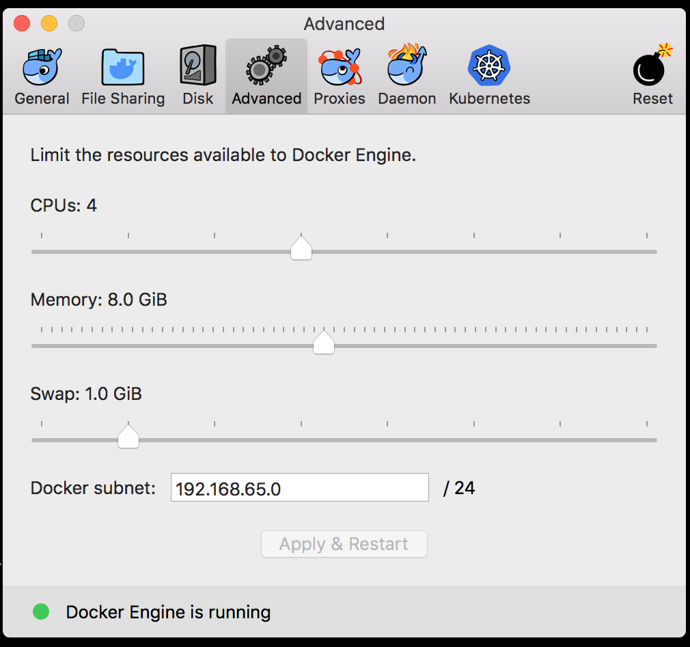

# Crafter CMS Docker Compose

This project provides Docker compose files that allow you to run Docker containers for the following Crafter CMS
environments:

* Authoring
* Delivery
* Serverless Delivery (external Elasticsearch service and content stored in S3)

**NOTE:** These files are intended for development use only. We recommend you create your own set of Docker compose
files for production and use these as a reference.

# Pre-requisites

1. Install Docker (https://docs.docker.com/install/)
2. Install Docker Compose (https://docs.docker.com/compose/install/)

**For Windows and Mac, we recommend you give Docker Desktop at least 8GB of RAM and 4 CPUs. To do this, go to Docker
Desktop's Preferences > Resources > Advanced, and then change the resource limits.**



# Mount the Authoring site repositories directory to a host directory

Sometimes you'll need to have the Authoring site repositories available in the host filesystem, specially if
you want to update the files from your IDE. To make the sites available, follow these steps:

**NOTE:** Performance may be slow when using WSL2 (Windows Subsystem for Linux 2) and a mounted Authoring site repositories directory to a host directory

**NOTE:** This will only work on an Authoring with no existing data. To clear the current data, run the same
command you've been using to start up the environment, but replace the `up` part for `down -v`.

0. Make sure the drive with the directory that will contain the sites is a shared drive (check Docker Desktop's
Preferences > Resources > File Sharing)
1. `cd authoring`
2. Open the `docker-compose.yaml` in an editor and add the following volume to both the `tomcat` and the `deployer`
service (assume `C` is the shared drive, and replace the `/host/path/to/sites` for the actual host path):
`- c:/host/path/to/sites:/opt/crafter/data/repos/sites`
3. Once you have started the Authoring environment, by following the steps below, go to the Authoring browser URL and create a site. You should be able to see the files in your host directory!

# Start Authoring Environment

## Start with script

```
$ cd scripts
$ ./start authoring [--enterprise, -e]
$ ./logs authoring # to output log
```

## Start manual
1. `cd authoring`.
2. `docker-compose up` to run the containers in the foreground or `docker-compose up -d` to run them detached in the
background (and `docker-compose logs -f` to tail the logs).

# Start Delivery Environment

## Start with script

```
$ cd scripts
$ ./start authoring [--enterprise, -e]
$ ./start delivery [--enterprise, -e]
$ ./logs delivery # to output log
```

## Start manual

1. Start the Authoring environment.
2. `cd delivery`.
3. `docker-compose up` to run the containers in the foreground or `docker-compose up -d` to run them detached in the
background (and `docker-compose logs -f` to tail the logs).

## Create a Delivery Site

1. `cd scripts`.
2. `./init-site <SITENAME>` (remember to replace `<SITENAME>` for the actual site name).

## Delete a Delivery Site

1. `cd scripts`.
2. `./remove-site <SITE_NAME>` (remember to replace `<SITE_NAME>` for the actual site name).

# Start Serverless Delivery Environment

1. Start the Authoring environment.
2. Follow https://docs.craftercms.org/en/3.1/system-administrators/activities/delivery/setup-serverless-site.html from
*Step 1: Create the site in the authoring environment* to *Step 3: Create the AWS Target in Authoring Crafter Deployer*.
Don't do *Step 4: Configure the Delivery Crafter Engine for Serverless Mode*.
3. `cd serverless/s3/delivery`.
4. Specify in the `serverless/s3/delivery/.env` file the required environment variables:
   - **ES_URL:** The AWS Elasticsearch endpoint (or any other valid Elasticsearch URL).
   - **crafter.engine.site.default.rootFolder.path:** The URL to the S3 bucket with the sites. Format is
     `s3://<BUCKET_NAME>/<SITES_ROOT>/{siteName}`. Example: `s3://serverless/sites/{siteName}`.
   - **crafter.engine.s3.region:** The AWS region of the S3 bucket.
   - **crafter.engine.s3.accessKey:** The AWS access key.
   - **crafter.engine.s3.secretKey:** The AWS secret key.
5. `docker-compose up` to run the containers in the foreground or `docker-compose up -d` to run them detached in the
background (and `docker-compose logs -f` to tail the logs).

# Stop an Environment

## Stop with script

```
$ cd scripts
$ ./stop <ENVIRONMENT (authoring, delivery)> [--delete-volumes, -v]
```

## Stop manual

- If `docker-compose` is running in the foreground, `CTRL+C` should stop the containers.
- If `docker-compose` is running detached, then call `docker-compose stop` or `docker-compose down`. The difference
between the two is that `down` will also remove the containers and networks created.

You can also run `docker-compose down -v` to delete the volumes, which contain the data and logs, when you want to
start with a fresh install.

# Backup Authoring/Delivery

1. `cd scripts`
2. `./backup <ENVIRONMENT> <BACKUP_FOLDER>` (remember to replace `<ENVIRONMENT>` (authoring or delivery) and `<BACKUP_FOLDER>`). E.g. `./backup authoring C:/Users/jdoe/Documents/Backups`

**NOTE:** In Windows, make sure `/host/path/to/backups` points to a path in a shared drive (check Docker Desktop's
Settings > Shared Drives)

# Restore Authoring/Delivery

1. `cd scripts`
2. `./restore <ENVIRONMENT> <BACKUP_FOLDER> <BACKUP_FILE>` (remember to replace `<ENVIRONMENT>` (authoring or delivery), `<BACKUP_FOLDER>` and `<BACKUP_FILE>`). E.g. `./restore authoring C:/Users/jdoe/Documents/Backups crafter-authoring-backup.2019-03-28-00-58-33.zip`

**NOTE:** In Windows and Mac, make sure `/host/path/to/backups` points to a path in a shared drive (check Docker
Desktop's Settings > Shared Drives)

# Run a command inside a running container

Running scripts or single commands inside a running container is pretty easy:

1. `cd` to the authoring/delivery compose project folder.
2. `docker-compose exec <SERVICE_NAME> gosu crafter <CMD> <PARAMETERS>`

E.g.

`docker-compose exec deployer gosu crafter ./bin/init-site.sh mysite /data/authoring/repos/sites/mysite/published`

For each authoring and delivery compose files there are 3 services:

- `elasticsearch`
- `tomcat`
- `deployer`

For serverless S3 delivery there's only one service: `tomcat`.

Please **ALWAYS** use `gosu crafter` with `docker-compose exec`. This ensures that all the commands are run as the
`crafter` user and that all new files and directories created belong to `crafter` (`gosu` is basically a version
of `sudo` that works better on Docker).

# Open a shell to a container

Sometimes you'll need to get a shell to a container for debugging purposes or for executing Git operations. To do this,
run the following command:

`docker-compose exec <SERVICE_NAME> gosu crafter bash`

This will open a Bash shell as the crafter user. The current directory will be `/opt/crafter`.

# Use Crafter CMS Enterprise Edition

To use the Enterprise Edition instead of the Community Edition follow these steps:

1. `cd ENVIRONMENT`
2. Copy your Crafter license under `./license/crafter.lic`
3. `docker-compose -f docker-compose.yml -f docker-compose.enterprise.yml up` or
`docker-compose -f docker-compose.yml -f docker-compose.enterprise.yml up -d`

## Enterprise Edition Compatible With Solr

Follow the previous steps, but in step 3, replace `docker-compose.enterprise.yml` with `docker-compose.solr.yml`
(e.g. `docker-compose -f docker-compose.yml -f docker-compose.solr.yml up`)
